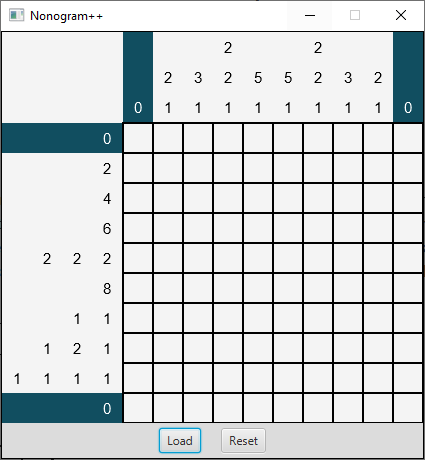
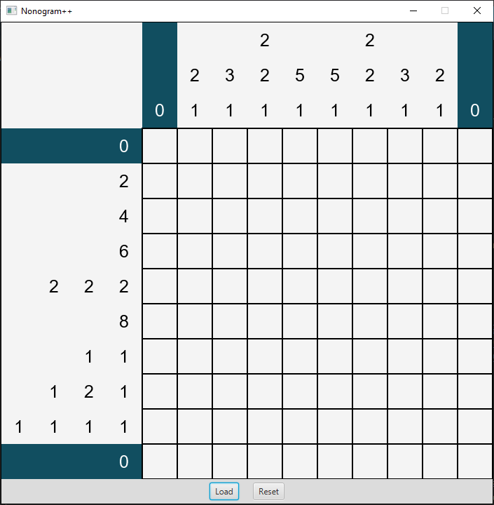
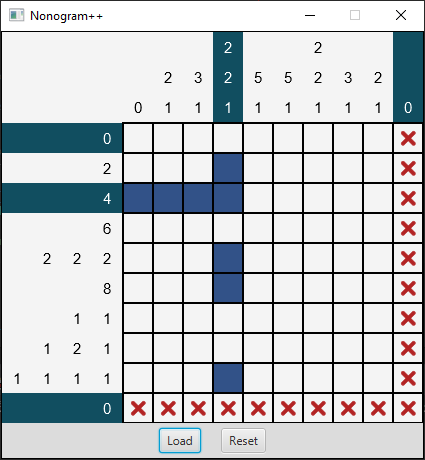
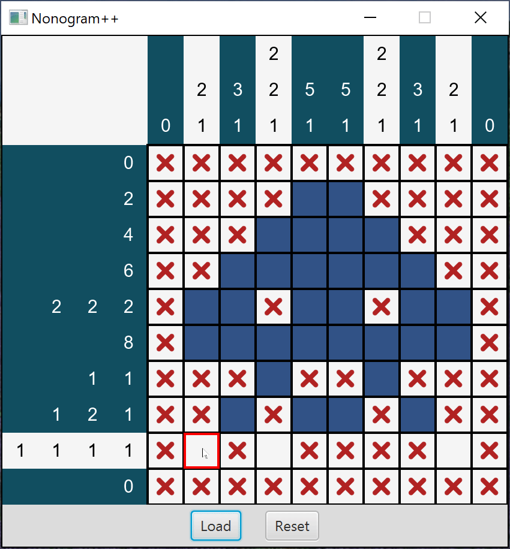
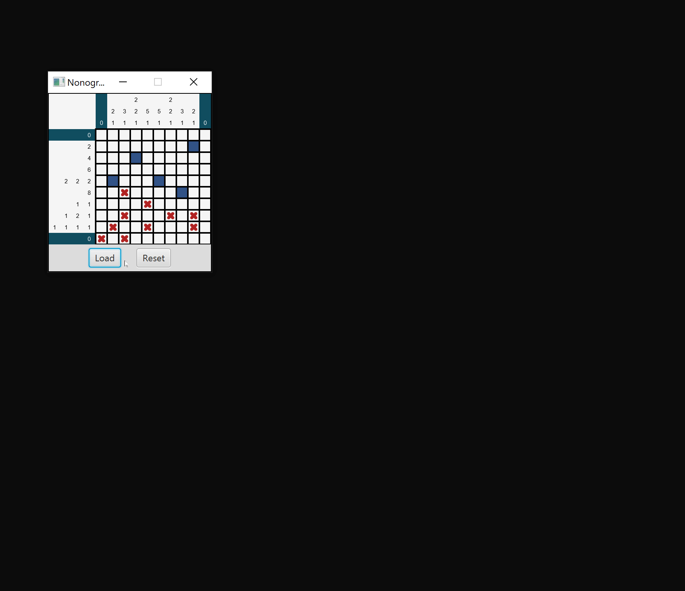
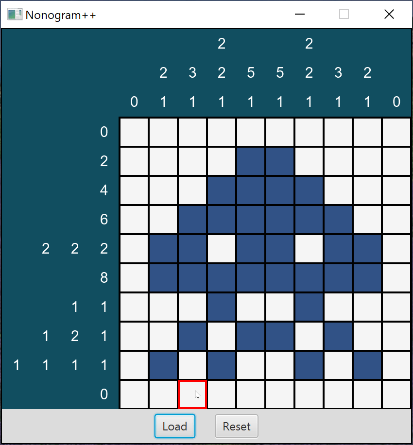

# Project: Nonogram Player

In this project, we will write a program that  a program that creates [nonograms](https://en.wikipedia.org/wiki/Nonogram) from [binary images](https://en.wikipedia.org/wiki/Binary_image) and allows us to play those puzzles.

The program can run with zero or one command line argument. In both cases, a
default puzzle file is loaded. You will need to modify your
**Run Configuration** arguments to test out different cell sizes.

Running our program with no arguments opens the default puzzle with a cell
size of 30:

```console
java Main
```



Running our program with a single argument of 50 opens the default puzzle with a
cell size of 50:

```console
java Main 50
```



Furthermore, you can load in different puzzles by clicking the **Load** button.
You can load in puzzles using the format defined in Project 4.<sup id="a1">[1](#f1)</sup>
For testing, we have included a few minimal puzzle files that do not contain
grid values at the bottom of the file (i.e., they only include the row count,
column count, row projections, and column projections).

Note that the background color of the clues in the first and last rows and the
first and last columns is midnight green instead of white.
This indicates that the states of the cells in these rows and columns solve the
clue numbers. In this case, the numbers are 0, so they are trivially solved by
the initial (empty) states.

Left-clicking on an empty cell changes its state to filled, which is represented
by the color blue. Right-clicking changes the state to marked, which is
represented by a red X. Marked cells are treated as empty when the game checks
whether a row or column is solved, but the marks can be used by the player to
label cells that they know are empty.

The next image shows the puzzle after changing the states of 8 cells to filled.
The new states solve the clues in the third row and fourth column, so the
background color of these clues changed to green. The leftmost filled cell
contradicts the clue in the first column, so its background color changed to
white.

The cells in the bottom row and right column have all been marked. This does not affect 
the clues, but it helps to show the constraints on the other cells.
For instance, if we also mark the cells in the top row and left column, it
becomes clear that the cells in the sixth row must all be filled.



The next image shows the puzzle with all but two of the clues solved.
Filling the cell in the eighth row and the eighth column will solve the puzzle.
Note that some of the filled cells in the previous image were incorrect, even though the background color of the corresponding clues was green.
Individual row and column clues usually have multiple solutions, and the background color will turn green for all of them.
To solve the entire puzzle, however, the clues for all the rows and columns must be solved simultaneously.<sup id="a2">[2](#f2)</sup>


The final image shows the behavior of the program when the player solves the
puzzle. An [Alert](https://openjfx.io/javadoc/11/javafx.controls/javafx/scene/control/Alert.html)
is displayed to notify the player. All of the marked cells are changed to empty
cells, and the color of the white square in the top-left corner turns green.
Additionally, the player can no longer change the states of the cells.



### Load Button

As previously mentioned, the **Load** button is used to load in a puzzle file.
When a new puzzle is loaded, the grid is resized to accommodate the new puzzle's
width and height. Furthermore, any existing marks are removed.



### Reset Button

The **Reset** button is used to clear all cells by setting them to the empty
state. If the puzzle was solved, the **Reset** button allows the player to solve
the puzzle again. After resetting a solved puzzle, the player should be able to
change cell states again.



## Program Design

For this project, you will be creating your own UML diagram. You can use
[UMLet](https://www.umlet.com/) to accomplish this task. Detailed requirements
for the UML diagram are given on Canvas.

You can [download UMLet stand-alone using this link](https://www.umlet.com/changes.htm).
**NOTE: Do not click the shady ad on the website.** Look for text that says

> New in UMLet 14.3 [stand-alone](https://www.umlet.com/download/umlet_14_3/umlet-standalone-14.3.0.zip) and [UMLet 14.3 Eclipse plugin (p2 repository)](https://www.umlet.com/download/umlet_14_3/umlet-eclipse-p2-14.3.0.zip)

and download the stand-alone edition. After downloading the UMLet zip file, you
can extract the files to a location on your machine. Windows devices can run 
Umlet.exe and umlet.jar. Macs can run umlet.jar. If you have any issues running
UMLet by double-clicking, try using the command line to navigate to the folder
with umlet.jar and run `java -jar umlet.jar`.

Below is an incomplete UML diagram:


